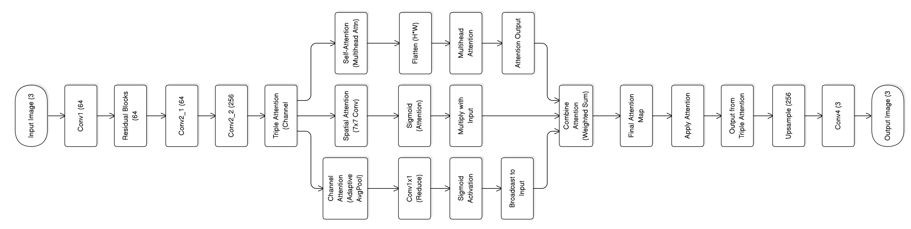
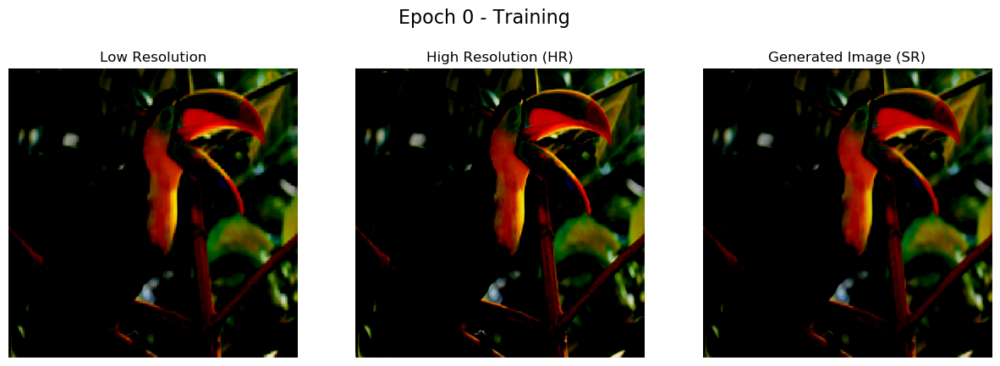
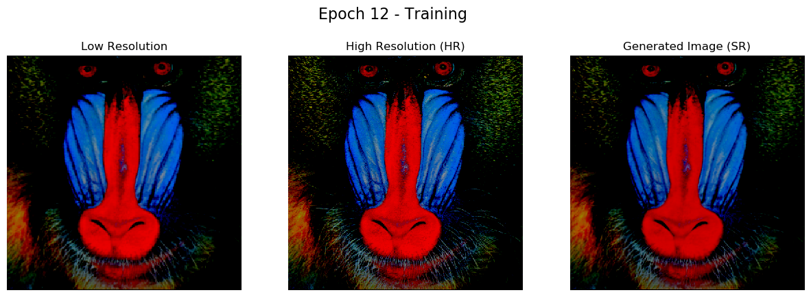
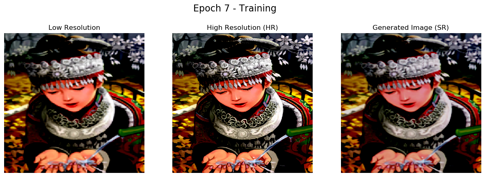

# TriAttNet: Triple Attention Network for Image Super-Resolution
**Written by: Anthony**
## Overview

TriAttNet is a cutting-edge image super-resolution model that integrates a novel **Triple Attention Mechanism**, which enhances image quality by learning complex dependencies across multiple dimensions. This model aims to push the boundaries of image resolution enhancement by combining three distinct types of attention: **Channel Attention**, **Spatial Attention**, and **Self-Attention**. By leveraging these mechanisms, TriAttNet can produce superior quality high-resolution images from low-resolution inputs, outperforming traditional methods that focus on only one aspect of the attention.

My experiments, conducted as part of this project, showcase the model’s ability to effectively capture both local and global dependencies in images, providing more accurate and detailed results in real-world applications photo camera and enhance camera result for resolution.

## Architecture

TriAttNet consists of a carefully crafted architecture that incorporates multiple deep learning techniques to enhance image resolution. Below are the core components of the model:

### 1. **Triple Attention Module**
   - **Channel Attention**: This mechanism captures the importance of each feature channel, enabling the model to focus on the most relevant features for enhancing image resolution.
   - **Spatial Attention**: By applying convolutional layers, spatial attention allows the model to highlight important regions of the image, improving the ability to capture fine-grained details.
   - **Self-Attention**: A multi-head self-attention mechanism is employed to capture long-range dependencies, enabling the model to learn the global structure of the image. This is particularly useful in high-resolution tasks where long-range context is crucial.

### 2. **Residual Blocks**
   The residual blocks in TriAttNet help preserve the identity mapping, which allows the model to learn deeper features without the risk of vanishing gradients. Each block consists of:
   - Convolutional layers with **Batch Normalization**.
   - Activation functions (PReLU) to introduce non-linearity.
   - **Dropout** layers to prevent overfitting.

### 3. **Upsampling Layer**
   The model upscales the low-resolution input to a higher resolution (512x512) using **bilinear interpolation**, ensuring that the output image maintains smooth transitions and fine details. This upsampling process is essential for generating high-resolution outputs while preserving the integrity of the original features.

### 4. **Final Convolution Layer**
   The final convolution layer refines the enhanced image and applies a **Tanh** activation function, ensuring that the pixel values are within the range suitable for output.

### Experiment Insights
Throughout the experiments, we observed that incorporating the **Triple Attention Mechanism** allowed the model to significantly improve upon traditional convolutional-based super-resolution methods. The performance in terms of **Peak Signal-to-Noise Ratio (PSNR)** and **Structural Similarity Index (SSIM)** was consistently better with training a lot of different kinds of HR images, especially when applied to datasets with diverse image content.
## Result 



# Performance Metrics

The following table shows the average PSNR and SSIM values for different scales and datasets.

| Scale | Set | Average PSNR (dB) | Average SSIM |
|-------|-----|--------------------|--------------|
| **2** | Set 5 | 29.70 | 0.8621 |
|       | Set 14 | 28.38 | 0.8421 |
| **3** | Set 5 | 28.13 | 0.8118 |
|       | Set 14 | 25.97 | 0.7396 |
| **4** | Set 5 | 26.44 | 0.7535 |
|       | Set 14 | 28.38 | 0.8421 |

## Requirements

To replicate the results or train your own model, the following dependencies are required:

- Python 3.x
- PyTorch (v1.7 or later)
- torchvision
- matplotlib
- numpy

You can install all necessary libraries via pip by running the following command:

```bash
pip install -r requirements.txt
